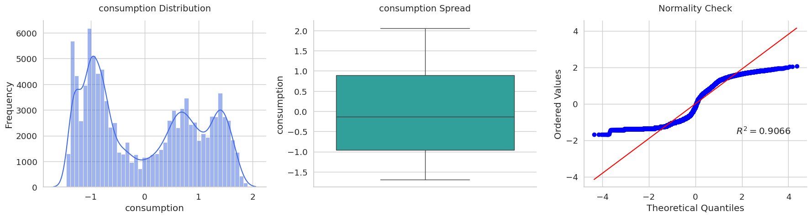
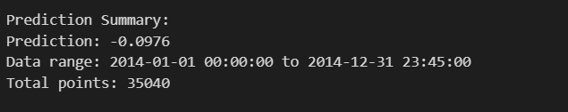
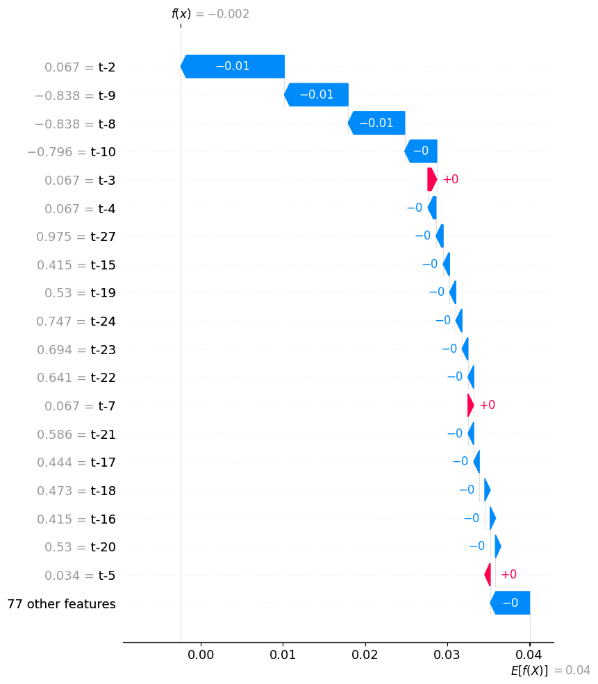

# Electricity Consumption Forecasting Project

## Overview
This project, developed by Aliaa, focuses on forecasting electricity consumption using a Recurrent Neural Network (RNN) model. The work is conducted in a Jupyter notebook with supporting Python files for configuration, model definition, and a Flask API that utilizes the `ElectricityPredictor` class. The project structure supports data management, modeling, and deployment, with an API for predictions and explanations.

## Author
- Name: Aliaa

## Project Structure
```
project/
├── data/
│   ├── raw/
│   │   ├── electricity_test.csv
│   │   └── electricity_train.csv
│   └── sequences_data/
│       └── sequences.csv
├── models/
│   ├── scaler.pkl
│   └── TimeSeriesRNN.pth
├── notebook/
│   ├── electricity_consump.ipynb
│   └── api_test.ipynb
├── src/
│   ├── app.py          # Flask API
│   ├── config.py       # Configuration settings
│   ├── model.py       
│   ├── predictor.py    
│   └── usage_example.ipyn        
├── .dockerignore
├── .gitignore
├── Dockerfile
├── README.md
├── requirements.txt
```

## 1. Data Exploration and Preprocessing

### 1.1 Initial Data Inspection
- Loaded `electricity_train.csv` using pandas.
- Converted `timestamp` to datetime objects.

### 1.2 Statistical Analysis
- Analyzed `consumption` column with descriptive statistics.
- Visualized distribution using histograms, boxplots, and Q-Q plots.

### 1.3 Data Transformation
- Applied Yeo-Johnson transformation for normalization.
- Standardized data with StandardScaler and saved to `scaler.pkl`.

### 1.4 Data Splitting and Sequencing
- Split data into 80% training and 20% testing sets (no shuffling).
- Created sequences (`seq_length = 96`) and saved to `sequences.csv`.

### 1.5 Tensor Preparation
- Converted data to PyTorch `TensorDataset` and `DataLoader`.

## 2. Model Development

### 2.1 RNN Model
- Defined `TimeSeriesRNN` class with GRU (default) support.
- Trained for 10 epochs with Adam optimizer and MSE loss.

### 2.2 Evaluation and Visualization
- Evaluated model and plotted training history and predictions.
 
- Predictions vs. Actual
 

### 2.3 Model Inference


## 3. Supporting Files

### 3.1 `config.py`
- Contains `Config` dataclass with model, data, and SHAP settings, including used paths and hyperparameters.

### 3.2 `model.py`
- Implements `TimeSeriesRNN` for reusability.

### 3.3 `predictor.py`
- Implements `ElectricityPredictor` for loading data, making predictions, and providing explanations.

### 3.4 `app.py`
- Flask API with CORS support and endpoints:
  - `/`: Health check.
  - `/api/predict/next`: Single prediction.
  - `/api/predict/multiple`: Multiple predictions.
  - `/api/explain`: Prediction explanation.

## 4. API Details

### 4.1 Endpoints
- **GET /**: Returns `{"message": "Electricity Predictor API is running"}`.
- **POST /api/predict/next**: Predicts the next value.
  - Request: `{"file_path": "path/to/file.csv"}`
  - Response: `{"prediction": float}`
- **POST /api/predict/multiple**: Predicts multiple values.
  - Request: `{"file_path": "path/to/file.csv", "n_steps": 5}`
  - Response: `{"predictions": [float, ...]}`
- **POST /api/explain**: Provides prediction explanation.
  - Request: `{"file_path": "path/to/file.csv"}`
  - Response: `{"explanation": {"values": [...], "base_value": float, "features": [...], "data": [...]}}`


## 5. Deployment

### 5.1 Dockerfile
- Configures a container for the Flask app.

### 5.2 Requirements
- Listed in `requirements.txt` (ensure `flask`, `flask-cors`, `requests`, and PyTorch dependencies are included).


## 7. Future Work
- Tune model hyperparameters.
- Increase training iterations.
- Enhance API features (e.g., real-time updates).

## 8. Usage
- Test predictions: `python usage_example.ipynb`.
- Start API: `python src/app.py`.
- Test API.
```

